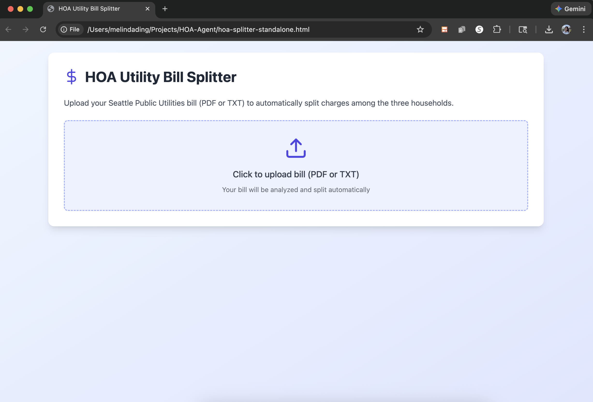
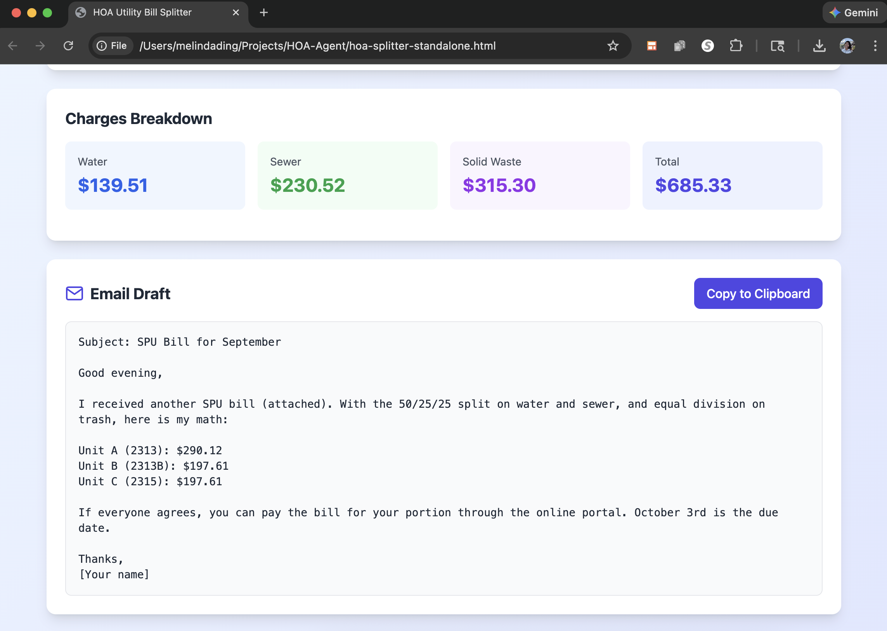
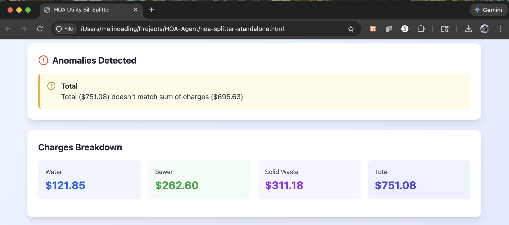

# HOA Utility Bill Splitter

A web application that automates the splitting of Seattle Public Utilities bills among three households in an HOA, with automatic anomaly detection and email draft generation.

## 🎯 Project Goals

### The Problem
Every two months, I receive a combined water, sewage, and trash bill from Seattle Public Utilities for our three-unit HOA. The manual process involved:
- Opening the PDF bill
- Manually extracting charges for water, sewer, and solid waste
- Calculating splits using different ratios (50/25/25 for water/sewer, even split for trash)
- Writing an email to notify the other households
- Checking for unusual charges that might indicate billing errors

This repetitive task consumed time and was prone to calculation errors.

### The Solution
Build a web application that:
1. Accepts PDF or text uploads of utility bills
2. Automatically extracts all charges
3. Calculates splits according to our agreed-upon ratios
4. Generates a ready-to-send email
5. Detects and flags anomalies or unusual charges

## 🚀 The Journey

### Phase 0: Exploring Options

Before settling on the Claude approach, I explored  AI assisted vibe-coding web app sites such as Bolt.new that could generate full-stack applications. However, these came with complications I didn't want such as:
- **Deployment Hassle**: Would need to host the app somewhere, manage servers, deal with uptime
- **Security Concerns**: Uploading financial documents (utility bills) to a third-party server felt risky
- **Overkill**: These tools were designed for complex applications, not simple utility scripts
- **Ongoing Maintenance**: Server costs, security updates, dependency management

**The Realization**: I didn't need a "real" web app. I needed something that:
- Runs entirely on my computer
- Processes sensitive financial data locally
- Requires zero maintenance
- Works offline
- Could be shared as a single file

This led me to Claude, where I could describe exactly what I needed and get a standalone solution without the overhead of traditional web app infrastructure.

### Development Approach: AI-Assisted Pair Programming

This project was built in collaboration with Claude through an iterative, conversational development process. Rather than writing code from scratch, I described what I needed, provided examples, and worked through problems as they arose.

### Phase 1: Initial Requirements
Started with a simple request: split utility bills automatically and generate emails. Key requirements:
- Support for Seattle Public Utilities bill format
- 50/25/25 split for water and sewer (unmetered units)
- Even 33/33/33 split for trash
- Email generation matching existing format

**Claude's Role**: Built the initial React-based interface with file upload, charge extraction logic, and email generation. Provided a working prototype in minutes.

### Phase 2: Adding Intelligence
Evolved to include:
- **Anomaly Detection**: Compare current charges against historical averages to flag unusual bills
- **PDF Parsing**: Direct PDF upload support using PDF.js library
- **Due Date Extraction**: Automatically pull due dates from bills

**Claude's Role**: Suggested anomaly detection thresholds based on typical utility bill variation. Integrated PDF.js library and handled the complexity of text extraction and positioning.

### Phase 3: Real-World Testing & Iteration
This is where the collaborative process really shined:

**Issue 1**: PDF parsing returned "$12" instead of "$685.33"
- I reported the bug
- Claude diagnosed the text extraction issue
- Fixed by implementing position-based text sorting

**Issue 2**: Discovered "Extra Garbage" charges in real bill
- I uploaded an actual bill showing adjustment charges
- Claude immediately understood these shouldn't be auto-split
- Proposed flagging them separately with prompts for unit attribution

**Issue 3**: Email format didn't match my existing style
- I shared an example of my actual email
- Claude adapted the output to match my concise format
- Changed unit names to match reality (Unit A/2313, Unit B/2313B, Unit C/2315)

**Claude's Role**: Quick iteration cycles. Each issue was understood in context and fixed within minutes. The AI handled the tedious parts (text parsing edge cases, date formatting, React state management) while I focused on the business logic and UX.

### Phase 4: Deployment Simplicity
Made it accessible:
- Created a standalone HTML file that runs entirely in the browser
- No server needed - complete client-side processing
- All data stays local for privacy
- Works offline after initial load

**Challenge**: I initially thought React apps needed complex build tools and couldn't run locally.

**Claude's Role**: Explained that React can run via CDN in a standalone HTML file. Created a fully self-contained version with all dependencies loaded from CDNs. Converted JSX icons to inline SVGs to eliminate all external dependencies except the CDN libraries.

### Total time: ~1 hour of conversation

## ✨ Key Features

- **Automatic Charge Extraction**: Parses Seattle Public Utilities bills (PDF or TXT)
- **Smart Bill Splitting**: 50/25/25 for water/sewer, even split for trash
- **Anomaly Detection**: Flags charges 30%+ different from historical average
- **Adjustment Tracking**: Identifies extra charges (like "Extra Garbage") separately
- **Email Generation**: Creates formatted drafts matching your communication style
<p align="center">
  
  
  
</p>

## 🛠️ Technical Implementation

**Stack**: React 18, PDF.js, Tailwind CSS, standalone HTML
<br>**Architecture**: Single-file application, client-side only, no backend

## 📊 Results & Impact

- **Time Savings**: 10-15 minutes → 2-3 minutes per bill (~80% reduction)
- **Error Prevention**: Eliminates manual calculation errors, catches unusual charges
- **Privacy**: All processing local, bills never leave your device

## 🎓 Lessons Learned

### AI-Assisted Development Works
- **Speed**: Idea to working app in ~1 hour
- **Iteration**: Real-time bug fixes and feature additions
- **Focus**: I handled requirements and testing; Claude handled implementation

## 📁 File Structure

```
utility-bill-splitter/
├── utility-splitter.html          # Standalone application
├── README.md                       # This file
└── examples/
    ├── Sept2025Bill.pdf           # Example bill (redacted)
    ├── May2025Bill.pdf            # Example with extra charges
    └── ExampleEmail.pdf           # Email format reference
```

## 🚦 Usage

1. Download `hoa-splitter-standalone.html`
2. Double-click to open in browser
3. Upload your Seattle Utilities bill (PDF or TXT)
4. Review charges and anomalies
5. Copy the generated email

**Requirements**: Modern browser, internet for initial CDN loads (works offline after)

## 📝 License

MIT License - Feel free to use, modify, and distribute as needed.

## 🤝 Contributing

This was built as a personal tool, but suggestions and improvements are welcome! If you find this useful and want to adapt it for your own HOA or utility provider, feel free to fork and modify.

## 💡 Inspiration

Born out of necessity - the best projects often are. Sometimes the most impactful software is the kind that saves you 15 minutes every two months, because those minutes add up, and manual repetitive tasks are soul-crushing.

**The AI Angle**: This project also demonstrates a new way of building software. Instead of spending hours researching PDF parsing libraries, learning React build tools, or debugging CSS positioning issues, I described what I needed in plain English and worked through problems conversationally. The result is a tool that solves my exact problem, built in the time it would have taken just to set up the development environment the traditional way.

## 📧 Contact

Questions? Found a bug? Want to share how you adapted this for your own use? Feel free to open an issue!

---

**Built with** ☕ and Claude AI - demonstrating that the future of software development is conversational.

*This entire project, including this README, was created through natural language conversation with Claude. Total development time: ~2 hours. Time saved per bill: ~15 minutes. Return on investment: Immediate.*